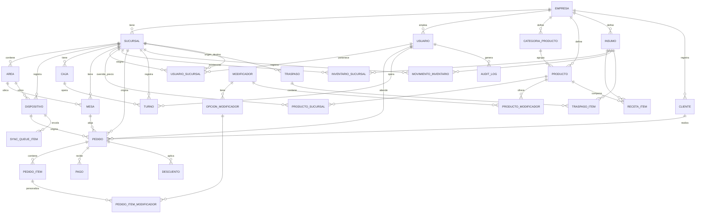

# HANGAR 421 — Modelo de datos

Jerarquía principal: **Empresa → Sucursal → Área/Estación → Dispositivo → Usuario → Operación**.
El esquema completo (fuente de verdad) vive en [`apps/backend/prisma/schema.prisma`](../apps/backend/prisma/schema.prisma).
Este documento resume las entidades y sus relaciones.

## Diagrama de entidades (resumen)

## Entidades principales

### Jerarquía organizacional
- **Empresa**: razón social, RFC/taxId, logo, configuración global.
- **Sucursal**: nombre, dirección, horario, timezone, moneda, tasa de impuesto, `activo`.
  Pertenece a una `Empresa`.
- **Area**: subdivisión física/lógica de la sucursal (`SALON`, `BARRA`, `COCINA`, `CAJA`,
  `ESTACION_COCINA`). Agrupa mesas, dispositivos y estaciones de preparación.
- **Dispositivo**: terminal física registrada (`POS_WINDOWS`, `TABLET_MESERO`, `CELULAR_MESERO`,
  `PANTALLA_COCINA`), con identificador único, sucursal y área asociada, última conexión.
- **Usuario**: persona con acceso al sistema; puede pertenecer a varias sucursales vía
  **UsuarioSucursal** (rol + permisos específicos por sucursal).

### Catálogo (centralizado, con override por sucursal)
- **CategoriaProducto**, **Producto** (precio base, receta, imagen).
- **ProductoSucursal**: precio efectivo, disponibilidad y `stockControlado` por sucursal —
  permite que "Latte" cueste distinto o esté agotado en una sucursal sin duplicar el producto.
- **Modificador** / **OpcionModificador** / **ProductoModificador**: tamaño, leche, temperatura,
  extras, azúcar — reutilizables entre productos.

### Operación de piso
- **Mesa**: número, capacidad, área, estado (`LIBRE`, `OCUPADA`, `RESERVADA`, `POR_COBRAR`,
  `PEDIDO_LISTO`).
- **Pedido**: folio, tipo (`MESA`, `MOSTRADOR`, `DOMICILIO`), mesa opcional, mesero, cajero,
  comensales, estado (`ABIERTO → ENVIADO → EN_PREPARACION → LISTO → ENTREGADO → POR_COBRAR →
  COBRADO` / `CANCELADO`), `sucursalId`, `dispositivoId`, `syncStatus`, `idempotencyKey`.
- **PedidoItem**: producto, cantidad, precio unitario congelado al momento de venta, notas,
  estado individual (permite que un item esté "listo" mientras otro sigue en preparación),
  estación de cocina asignada.
- **PedidoItemModificador**: opciones elegidas + costo extra.
- **Descuento**: monto o porcentaje, motivo, `autorizadoPor` (supervisor).
- **Pago**: método (`EFECTIVO`, `TARJETA`, `TRANSFERENCIA`, `QR`, `MIXTO` vía múltiples filas),
  monto, referencia, usuario que cobra.
- **Caja** / **Turno**: apertura (monto inicial), cierre (declarado vs. sistema, diferencia).

### Inventario
- **Insumo**: unidad de medida, costo unitario.
- **RecetaItem**: cuánto insumo consume un producto (descuento automático al vender).
- **InventarioSucursal**: existencia actual, mínimo, máximo por sucursal.
- **MovimientoInventario**: `ENTRADA`, `SALIDA`, `AJUSTE`, `MERMA`, `CONTEO`, con usuario,
  motivo, referencia (p. ej. pedido que generó la salida) y fecha.
- **Traspaso** / **TraspasoItem**: sucursal origen/destino, estado
  (`SOLICITADO → AUTORIZADO → ENVIADO → RECIBIDO → VALIDADO` / `CANCELADO`), cantidades
  solicitada/enviada/recibida y diferencia (para validar mermas en tránsito).

### Clientes / CRM
- **Cliente**: datos de contacto, puntos de lealtad, preferencias, historial (vía `Pedido`).

### Plataforma / trazabilidad
- **AuditLog**: entidad, entidad afectada, acción, valores antes/después, usuario, dispositivo,
  sucursal, IP, fecha — usado por descuentos, cancelaciones, cambios de precio, caja, traspasos.
- **SyncQueueItem**: cola de sincronización por dispositivo — entidad, operación, payload,
  `idempotencyKey`, estado (`PENDIENTE/SINCRONIZADO/ERROR`), intentos, último error.

## Campos comunes de trazabilidad

Toda entidad operativa (Pedido, Pago, MovimientoInventario, Traspaso, Turno, Descuento) incluye:
`empresaId`, `sucursalId`, `usuarioId`, `dispositivoId`, `createdAt`/`updatedAt`,
`syncStatus` (`PENDING | SYNCED | CONFLICT | ERROR`) y queda referenciada en `AuditLog` cuando
la operación es sensible.

Esquema completo con tipos, enums e índices: ver `apps/backend/prisma/schema.prisma`.
